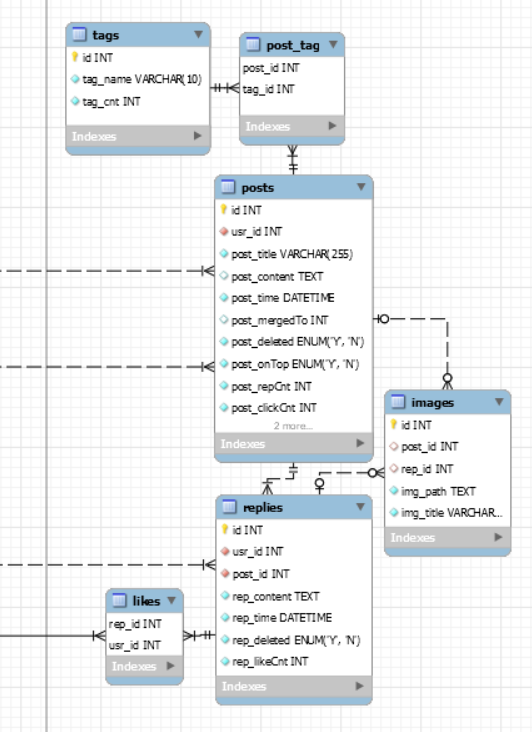

# 数据模型与查询语言

之前也写过两三个后端，但是由于我个人视野的局限，以及短期内必须交付完工的任务，我没有尝试特别多的数据模型 / 数据存储方式。

使用的，当然就是目前仍旧十分流行的 `MySQL` 了。但是我能够明确的感受到，我设计的后台应用是极其琐碎的，是很难完成庞大数据处理、数据分析、数据应用等其他一系列行为的。

在最开始的两次数据库建模时，仅仅是使用 `MySQL` 自带的 `Workbench` 来自动生成数据库脚本而已，并没有仔细思考业务的数据流，以及更应该考虑的组织数据的方式。

并且最要命的，我永远都是根据已有的业务来展开自己数据的设计。但我个人以为是不应该如此的。对于开发而言，交付并非是结束，而应该是新的开始。在新的开始之后，又会有许多许多的新需求出现，也会有之前的许多没有暴露出来的问题出现。我应该能够尽可能地在保护原有数据模型的前提下，满足新的业务发展方向才对。而不应该是大动干戈，为了一两个新的业务，把整个后台重写一遍。

## 关系模型与文档模型

### 对象关系不匹配

我想我应该更早了解 `NoSQL` 的，而不是现在。在我去年实际写后端代码的时候，我应该就体会到了一些本不合理的事情：

```python
class DbResult(object):

    def __init__(self, record_names, records):
        self.__length = len(records)
        self.__Record = namedtuple('Record', record_names)
        self.__records = []
        try:
            for each_record in records:
                self.__records.append(self.__Record._make(each_record))
        except Exception as e:
            traceback.print_exc()
        self.__records = tuple(self.__records)

    # 返回记录的数量
    def size(self):
        return self.__length

    # 返回 记录 与字段名匹配的 由 字典 组成的 元组
    def records(self):
        self.__records_dict = []
        for each_record in self.__records:
            self.__records_dict.append(dict(each_record._asdict()))
        self.__records_dict = tuple(self.__records_dict)
        return self.__records_dict
```

这 20 行代码，是我大一上学期第一次参与后端代码搬砖时，与我一起合作的同年级同学写的。非常抱歉，我在后面大二下学期的数据库课设直接 C-V 了这段代码，由于我当时不打算用任何 `ORM` 工具，所以这段代码对我来说十分有价值。

我很难理解一件事：在上世纪关系数据库理论刚刚诞生的时候，有很多人觉得这个理论是鸡肋，根本实现不出来。

在我看来这分明是一个在逻辑上非常好实现的东西嘛？在一个简单的应用里，比如中国 `CS` 专业 `DB` 课程中经常涉及到的 `Student-Course-Teacher` 模型，其可以使用 `Student` 的 `ID` 找到教授 `Ta` 的所有 `Teacher` 的 `ID`（尽管会花费一些功夫呢）。

但是！这些就是我应该看出来的地方。关系数据库为了减少内存/磁盘空间的消耗，使用了大量减少冗余的方法，关系范式就是一个很好的例子。但是还是那句老话，都 21 世纪了，我也不需要考虑什么消耗不消耗的了。

正如书中所说的：

> 传统 `SQL` 模型中，最常见的规范化表示形式是将 `职位，教育和联系信息` 放在单独的表中，对 `User` 表提供外键引用。

听说我校 18 级大三下的数据库课设要求关系模型达到 `3NF`：


平常上课学的理论是关系数据库理论，实验使用的也是关系型数据库，如果动手做项目的时候把项目范围限制在 “开发网站” 上，并且必须遵循 `3NF`，这件事儿在我看来就多少有点不太有趣了。

在关系型数据库中，我们通常使用一堆表对一个实体进行描述：



这是之前由于各种原因没有完成的论坛的数据库关系模型。可以看到一个 `posts` 周围 “围绕” 了很多表。但或许这么表示更好：

```json
{
    "id": int,
    "usr_id": int,
    "title": string,
    "time": datetime,

    "tags": [
        {
            "id": int,
            "name": string,
            "cnt": int
        }
    ],

    "replies": [
        {
            "id": int,
            "usr_id": int,
            "context": text,
            "time": datetime,
            "is_deleted": bool,
            "like_cnt": int
        }
    ]
}
```

里面有一些属性没有写上去，但是大体来看是这样的。

关系数据库理论的 `1NF`：

> 数据库表的每一列都是不可分割的基本数据项，同一列中不能有多个值，即 **实体中的某个属性不能有多个值或者不能有重复的属性**。

用我自己不规范的话来说，就是在摒弃一个属性中的 **数据粒度非最小化** 的情况。但是这无疑为后端增添了不小的困难。

我们听说过 `FrontEnd`，听说过 `BackEnd`，由于二者的开发思路和 `API` 或许有略微差别，因此我们听说过 `BFF`，但是使用关系型数据库的话，我们何尝又不是需要写一个 `BFD(Backend For Database)` 呢？

从直观感受来讲，`json` 毫无疑问能够避免一些无聊的 **外键** 被引入进来，这是因为整个 `json` 就像是已经做完 **JOIN** 操作的结果了。

所以以 `MongoDB` 为例，获取我的 `reply`，只需要：

```python
import pymongo

'''
some code to init client
'''

db = client["bbsdb"]
stu_doc = db["student"]
post_doc = db["post"]

user_need = stu_doc.find({ "name": "skyleaworlder" })
reply_need = doc.find({ "usr_id": user_need["id"] })

print(reply_need)
```

这样就大功告成了。虽然操作起来像是使用了 `ORM` 的关系型数据库一般，但是实际上或许完全不一样。（？）

曾经我会以为理解这些东西很困难，但如果仅仅是使用它的话，只是知晓用法，那应该是都很简单的，只是一个调用 `API` 的过程而已，没什么困难的。

正因此，我之后也要变得勇于尝试。尽管调 `API` 是很拉胯的，但是之间产生了问题，就会不得不让我向更内层钻研了，从而获得更深入的理解。

### 多对一和多对多的关系

即使刚才，我在从我过去的应用中挑选例子的时候，也在避免 **多对一和多对多关系** 的选择。道理很简单，因为我不会，也想不到。

每到这个时候，我就会感慨悲叹自己为什么不知道。实际上多对一或者多对多关系有着很多需要考虑的地方。

在关系型数据库中，毫无疑问，只要涉及 **多** 这个概念，就会用 `ID` 拆表，哪怕这个 `ID` 没有意义。比如上面的 `post_tag` 表，比如 `usr_post` 表，就是使用了两个外键作为联合主键。（当然这里的 `ID` 从某种层度上来说，还都是有意义的，至少它 **唯一标识了某个表中的一条记录**）

在非关系型数据库中，存在一个抉择，那便是 **选择 `ID` / 选择意义**：

* 选择了 `ID`，就代表会引入一个没有意义的符号，但是一旦添加，它永不变；
* 选择了意义，就代表这个键值对的表示现实生活中的某个事物或者事物的属性，它或许是可以改变的。

倘若我们在所有地方都选择了 **意义**，那么一个地方的改变，会导致很多地方跟着改变。这毫无疑问增加了 `CUD` 时间上的损耗，尤其是 `U`。

对于 `json` 这个数据结构，我们可以从感官上了解到，它是 “自上而下组织” 的数据结构。而关系模型则是一个 “平面” 的数据结构。（这些说法完全是 Geng 言 Geng 语）

在我看来，关系模型一直秉持这样一个观点：

* 多对一的关系可以转化为一对多的关系；
* 多对多的关系可以转化为许多个一对多的关系。

那么对于非关系型数据库而言，这种思想是不是可以使用？由于我自身开发经验的匮乏，这个问题自然我是无法想象的。

但是我可以想清楚一点：**非关系型** 并不适应生活中的方方面面。换句话说，我认为至少是 `json`，不能够 **很好地做到** 组织所有种类的数据。

正如书中所说的：

> 此外，即便应用⽤程序的最初版本适合⽆连接的⽂档模型，随着功能添加到应⽤程序中，数据会变得更加互联。

> 比如，一位老师教授多名学生，一名学生也听多位老师的课。

这个例子在日常生活中是很常见的。作为中国 `CS` 专业 `DB` 课程中经常涉及到的模型，它潜移默化，告诉学生关系理论能够坚挺二十年的原因。

虽然老套，但对我来说，关系理论和 “万物皆对象” 这句话一样，都被植入了每个中国 `CS` 学生的大脑深处。

> 再比如，某个人他就读于北京大学，北大既是一个字符串，也是一个实体，因为北大明显还具备着一些属性——它的地理位置、各项排名、教育教学资源等等。

因此没法很好地使用 `json` 这么一个必须在一开始定好数据类型的格式来说明。（除非 `Univ` 作为实体，而 `Univ["name"]` 来作名字，但是这样，一个实体的占用空间会不会太多了）

### 文档数据库是否在重蹈覆辙

我还没看到这里的时候就自己总结出来了，我说 `json` 这个文档形式或许是一个 **自上而下** 的数据结构。

换句话来说，就是一个 **层状结构**？

其实不是的。

上面说了，文档数据库在一对多关系上表现出了格外的活力，但是在多对一和多对多情况下可以与关系型数据库完全一致。

在阅读上面 **文档数据库** 可能存在的问题时，我就想：“如果文档数据库它也可以在查找 **多对一 / 多对多** 关系时像关系数据库那样就好了。”

但是它本来不就是一回事嘛。

#### 哪个数据模型更方便写代码

我虽然还不知道非关系数据库的内部原理，但是从关系数据库的角度来想，关系数据库的主要性能瓶颈应该是 “全表扫描” 和 “连接”？

而直接拿出 **一棵树** 的做法或许有时候更好？

但是现实生活中存在的大规模多对多关系又使得文档型数据库很难做到数据库中的数据一致性。

## 数据查询语言

### 命令式和声明式

这两个概念挺让人犯迷糊的。对于一个给定的获取数据的操作：`getUsersByGroupId`

```python
# declarative
users = [user for user in users if user["group_id"] == group_id]

# imperative
users = []
for user in users:
    if user["group_id"] == group_id:
        users.append(user)
```

也就是说：

* 声明式不看重操作其控制流，只是说明了要做什么；
* 指令式则不仅仅看重做什么，也看重如何去做。

### MapReduce

尽管现在用的很少了，但是它对我依旧有一种吸引力。

## 图数据库

如果说文档型数据库由于其具备树形结构化数据能力，从而可以很好地处理一对多关系，那么图数据模型从数据结构的直观理解上，就是存储多对多关系数据的数据库模型。

### 其他数据模型和查询语言

当然书里面还介绍了很多，但是我都没有怎么仔细看了。
