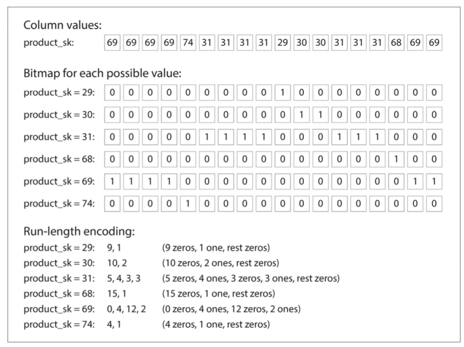

# 存储与检索

## 哈希索引

### 并发控制

追加日志看起来是浪费的。我之前只是以为，追加日志是为了保证日志的不可篡改性。

日志文件自然要是能够真正记录机器运行情况的，而不是可以被日志记录系统轻易修改的文件。但是书中还给出了多个令人信服的理由，说明 **追加日志要更加优秀**：

* 追加是顺序写入，比随机写入快；
* 如果段文件是附加的、不可变的，并发和崩溃回复起来要容易一些；
* 合并旧段可以避免数据文件随时间推移而分散的问题。

就哈希表索引本身而言，物理特性决定了它不会特别高效，因为磁盘随机访问就是缓慢的。同时在学数据库的时候也学了，哈希表对于等值查找有优势，但是对于范围查找就拉了大胯。

### SSTables 和 LSM 树

我没有过深入应用大型存储设备的经历，所以也不知道怎么样的复杂度在现代设备中是可以接受的。

但是我有一种直觉，貌似 O(logn) 应该就可以算是好的了。

`SSTables(Sorted String Table)` 就不错，合并的时候是 `O(n)`，插入、查找、删除都是 `O(logn)`。

### 内存中存储一切

我也是第一次知道，原来内存中的数据结构和磁盘中的数据结构不同。内存数据库不是因为不需要去磁盘读取数据才比磁盘数据库快。磁盘存储引擎也有可能长期不读取磁盘内的数据。

内存数据库更快的原因是其不需要 **将内存数据结构编码为磁盘数据结构**。（操作系统缓存是在内存中应用了磁盘块，因此数据结构还是磁盘数据结构）

## 列存储

我从来没有考虑过在关系模式中使用列存储。因为我会觉得对于文件的 IO 会是个缓慢的事情。

但是如若一条记录有几十上百个属性，就好似我们大学的考试系统的主表(80 多个)。由于 `SQL` 语句先执行连接，而后执行筛选和投影。那么就会把所有行加载到内存中，之后再去过滤和选列，这无疑是极其不好的。

而面向列的话，我可以把数据库里面的每一列都抽出来当成一个文件，然后按照合理的编码形式存储。**不把一行的所有值存在一起，而是将来自一列的所有值存储在一起**。

上面所说的这种 **合理的编码形式** 是一定存在的。在大多数的属性中，我们可以看到很多的连续重复情况。同时，由于数据仓库是只读的，因此可以更过分地要求压缩率。

比如哈夫曼树；如果属性值的种类实在有限的话，可以考虑位图压缩法：

同时位图压缩索引适合 `WHERE A IN (...)` 以及 `WHERE Condition-A AND Condition-B` 的情况。

由于在关系模型中，一列才代表属性，因此列才具有真正的可分析的价值；而行仅仅是表示一条记录而已，这条记录的含义、价值还是由其中的列共同决定的。

**在查询当中，一定无法躲开列**。我听说过 `SELECT col1, col2...`，但是谁听说过查询语句 `SELECT row1, row2` 呢？有意义、有价值的查询无法避免属性。

这样我做分析的时候只需要解析查询语句，分析其到底需要本表的哪些列，这样就可以节约很多时间了。

### 几个不同的排序顺序

我觉得想到这个方式的人是个天才般的普通人。

如果数据存在一个机器上不保险，可能有损失的风险，那么我就存在多个机器上，让所有机器之间保持（短期的或者长期的）一致性。
如果数据一种排序方式只能使得仅仅 2~3 种属性数据在分析时受到特殊照顾，那我就多引用几种不同的排序顺序，并把这些源数据相同，但互相之间因排序方式不同造成的不同数据放在不同的机器上。

这样又保证了安全，又方便了查询分析。

### 写入列存储

因为我已经压缩了，所以写入或许是个不方便的事情。插入一行，对于 B 树，可能要考虑重写大多数列文件。

而 LSM 树是在内存中维护了一块空间，所有新增条目都写入这个空间并按照磁盘中的排序方法排序。而之后的合并是可以接受的。

只不过如果磁盘中有数据，内存中也有数据，在查询的时候就需要另算了。这或许是个不好的地方。
