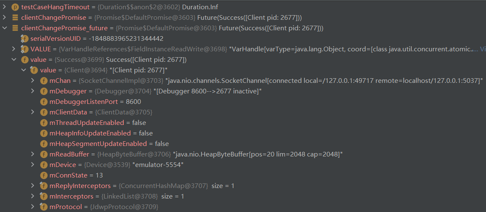

# JDI

使用 ddmlib executeShellCommand 时，可以看到 emulator 中多了这样 3 个进程。

```shell
UID             PID   PPID C STIME TTY          TIME CMD
shell          2660    337 0 07:12:43 pts/1 00:00:00 sh -c am instrument -w -r  --no-window-animation  -e debug true -e class 'com.example.myapplication0.ExampleInstrumentedTest#useAppContext' com.example.myapplication0.test/androidx.test.runner.AndroidJUnitRunner
shell          2662   2660 0 07:12:43 pts/1 00:00:00 app_process /system/bin com.android.commands.am.Am instrument -w -r --no-window-animation -e debug true -e class com.example.myapplication0.ExampleInstrumentedTest#useAppContext com.example.myapplication0.test/androidx.test.runner.AndroidJUnitRunner
u0_a155        2677    283 0 07:12:43 ?     00:00:00 com.example.myapplication0
```

只有看到了第三个 process，client 才可能被获取。



下方是所有线程：

```shell
generic_x86_arm:/ $ ps -ef -T | grep application0
UID             PID         PPID    C STIME TTY          TIME CMD
shell          2660  2660    337    1 07:12:43 pts/1 00:00:00 sh -c am instrument -w -r  --no-window-animation  -e debug true -e class 'com.example.myapplication0.ExampleInstrumentedTest#useAppContext' com.example.myapplication0.test/androidx.test.runner.AndroidJUnitRunner
shell          2662  2662   2660   14 07:12:43 pts/1 00:00:00 app_process /system/bin com.android.commands.am.Am instrument -w -r --no-window-animation -e debug true -e class com.example.myapplication0.ExampleInstrumentedTest#useAppContext com.example.myapplication0.test/androidx.test.runner.AndroidJUnitRunner
shell          2662  2663   2660   14 07:12:43 pts/1 00:00:00 app_process /system/bin com.android.commands.am.Am instrument -w -r --no-window-animation -e debug true -e class com.example.myapplication0.ExampleInstrumentedTest#useAppContext com.example.myapplication0.test/androidx.test.runner.AndroidJUnitRunner
shell          2662  2664   2660   14 07:12:43 pts/1 00:00:00 app_process /system/bin com.android.commands.am.Am instrument -w -r --no-window-animation -e debug true -e class com.example.myapplication0.ExampleInstrumentedTest#useAppContext com.example.myapplication0.test/androidx.test.runner.AndroidJUnitRunner
shell          2662  2665   2660   14 07:12:43 pts/1 00:00:00 app_process /system/bin com.android.commands.am.Am instrument -w -r --no-window-animation -e debug true -e class com.example.myapplication0.ExampleInstrumentedTest#useAppContext com.example.myapplication0.test/androidx.test.runner.AndroidJUnitRunner
shell          2662  2667   2660   14 07:12:43 pts/1 00:00:00 app_process /system/bin com.android.commands.am.Am instrument -w -r --no-window-animation -e debug true -e class com.example.myapplication0.ExampleInstrumentedTest#useAppContext com.example.myapplication0.test/androidx.test.runner.AndroidJUnitRunner
shell          2662  2668   2660   14 07:12:43 pts/1 00:00:00 app_process /system/bin com.android.commands.am.Am instrument -w -r --no-window-animation -e debug true -e class com.example.myapplication0.ExampleInstrumentedTest#useAppContext com.example.myapplication0.test/androidx.test.runner.AndroidJUnitRunner
shell          2662  2669   2660   14 07:12:43 pts/1 00:00:00 app_process /system/bin com.android.commands.am.Am instrument -w -r --no-window-animation -e debug true -e class com.example.myapplication0.ExampleInstrumentedTest#useAppContext com.example.myapplication0.test/androidx.test.runner.AndroidJUnitRunner
shell          2662  2670   2660   14 07:12:43 pts/1 00:00:00 app_process /system/bin com.android.commands.am.Am instrument -w -r --no-window-animation -e debug true -e class com.example.myapplication0.ExampleInstrumentedTest#useAppContext com.example.myapplication0.test/androidx.test.runner.AndroidJUnitRunner
shell          2662  2671   2660   14 07:12:43 pts/1 00:00:00 app_process /system/bin com.android.commands.am.Am instrument -w -r --no-window-animation -e debug true -e class com.example.myapplication0.ExampleInstrumentedTest#useAppContext com.example.myapplication0.test/androidx.test.runner.AndroidJUnitRunner
shell          2662  2672   2660   14 07:12:43 pts/1 00:00:00 app_process /system/bin com.android.commands.am.Am instrument -w -r --no-window-animation -e debug true -e class com.example.myapplication0.ExampleInstrumentedTest#useAppContext com.example.myapplication0.test/androidx.test.runner.AndroidJUnitRunner
shell          2662  2673   2660   14 07:12:43 pts/1 00:00:00 app_process /system/bin com.android.commands.am.Am instrument -w -r --no-window-animation -e debug true -e class com.example.myapplication0.ExampleInstrumentedTest#useAppContext com.example.myapplication0.test/androidx.test.runner.AndroidJUnitRunner
shell          2662  2674   2660   14 07:12:43 pts/1 00:00:00 app_process /system/bin com.android.commands.am.Am instrument -w -r --no-window-animation -e debug true -e class com.example.myapplication0.ExampleInstrumentedTest#useAppContext com.example.myapplication0.test/androidx.test.runner.AndroidJUnitRunner
shell          2662  2675   2660   14 07:12:43 pts/1 00:00:00 app_process /system/bin com.android.commands.am.Am instrument -w -r --no-window-animation -e debug true -e class com.example.myapplication0.ExampleInstrumentedTest#useAppContext com.example.myapplication0.test/androidx.test.runner.AndroidJUnitRunner
shell          2662  2676   2660   14 07:12:43 pts/1 00:00:00 app_process /system/bin com.android.commands.am.Am instrument -w -r --no-window-animation -e debug true -e class com.example.myapplication0.ExampleInstrumentedTest#useAppContext com.example.myapplication0.test/androidx.test.runner.AndroidJUnitRunner
u0_a155        2677  2677    283   14 07:12:43 ?     00:00:00 com.example.myapplication0
u0_a155        2677  2687    283   14 07:12:43 ?     00:00:00 com.example.myapplication0
u0_a155        2677  2688    283   14 07:12:43 ?     00:00:00 com.example.myapplication0
u0_a155        2677  2689    283   14 07:12:43 ?     00:00:00 com.example.myapplication0
u0_a155        2677  2690    283   14 07:12:43 ?     00:00:00 com.example.myapplication0
u0_a155        2677  2691    283   14 07:12:43 ?     00:00:00 com.example.myapplication0
u0_a155        2677  2692    283   14 07:12:43 ?     00:00:00 com.example.myapplication0
u0_a155        2677  2693    283   14 07:12:43 ?     00:00:00 com.example.myapplication0
u0_a155        2677  2694    283   14 07:12:43 ?     00:00:00 com.example.myapplication0
u0_a155        2677  2695    283   14 07:12:43 ?     00:00:00 com.example.myapplication0
u0_a155        2677  2696    283   14 07:12:43 ?     00:00:00 com.example.myapplication0
u0_a155        2677  2697    283   14 07:12:43 ?     00:00:00 com.example.myapplication0
u0_a155        2677  2698    283   14 07:12:43 ?     00:00:00 com.example.myapplication0
u0_a155        2677  2699    283   14 07:12:43 ?     00:00:00 com.example.myapplication0
```

只有获得了 client，才知道 Debugger 开启的 port。进而通过 host / port 获取 **vm**。
